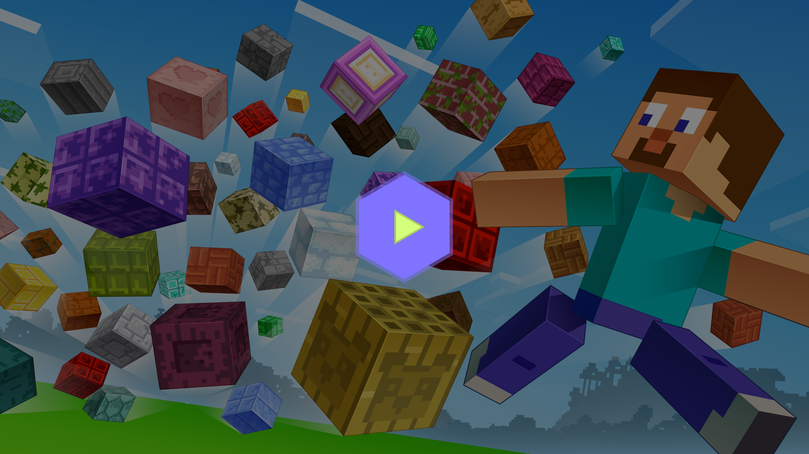
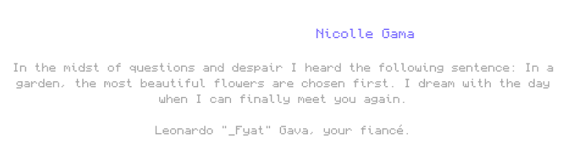

# Some More Blocks · 
  

**Some More Blocks** is a vanilla+ mod which adds new blocks variations to the game.
The mod adds over 500 new blocks, such as bricks, tiles, mossy blocks, wood mosaics, and much more to expand your building possibilities.

1. Download and install the Mod Loader of your choice
- [Fabric](https://fabricmc.net/use/installer/) and [Fabric API](https://www.curseforge.com/minecraft/mc-mods/fabric-api/files/all?page=1&pageSize=20&version=1.21.7)
- [Forge](https://files.minecraftforge.net/net/minecraftforge/forge/index_1.21.7.html)
2. Download the mod on official links and drop into your mods folder
- [CurseForge](https://www.curseforge.com/minecraft/mc-mods/some-more-blocks/files/all?page=1&pageSize=20&version=1.21.7&showAlphaFiles=hide)
- [Modrinth](https://modrinth.com/mod/some-more-blocks/versions?g=1.21.7)

Want to help bring this mod to more players? You totally can!

Whether you're fluent in another language or just want to help polish a few lines, every bit counts. We give credit to all contributors — your name will be listed as a thank-you for making the mod more accessible!

Ready to help? Join us on [Crowdin](https://crowdin.com/project/minecraft-some-more-blocks).

Spotted something weird or broken? Bugs happen, and your help makes this project better for everyone. You can open an issue [here](https://github.com/Seface-Studios/some-more-blocks/issues), or even send a pull request if you’ve got a fix in mind. We appreciate any help!

---

---

  
  <h3>Seface Studios</h3>
  
<a href="mailto:contact@sefacestudios.net">contact@sefacestudios.net</a> · <a title="X (fka Twitter)" href="https://x.com/SefaceStudios">𝕏 (fka Twitter)</a> · <a title="Discord Server" href="https://discord.gg/c8fvBPrAqD">Discord Server</a>

